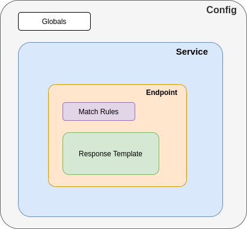

# Configuration Syntax

Mockintosh supports JSON and YAML formats for the mock server configuration file.

The most important entities in the config file are: Service, Endpoint, Response:



There are two main aspects of endpoint configuration: matching and templating. [Matching](Matching.md) defines how to
recognize request and pick the corresponding response template. [Templating](Templating.md) gives capabilities to
configure different response fields, and also make responses to be dynamic.

_Note: There is
a [JSONSchema of configuration syntax](https://github.com/up9inc/mockintosh/blob/main/mockintosh/schema.json)
that is used to validate all configuration files. You can use that as a formal source of configuration syntax._

## Defining Services

When defining services, the key property is `port`, which defines on which port the server will be available to
requests. It is also a good practice to specify `name` property, which is just piece of string. You can configure one or multiple services at once.
Here's a minimalistic working example:

```yaml
services:
  - name: Catalogue API
    port: 8001
    endpoints:
      - path: /
  - name: Cart API
    port: 8002
    endpoints:
      - path: /
```

You can additionally specify `hostname` property to make service _only_ respond to requests that contain specific `Host`
HTTP header:

```yaml
services:
  - name: I'm like Google
    port: 8001
    hostname: www.google.com
    endpoints:
      - path: /
```

_Note: There is special `MOCKINTOSH_FORCE_PORT` environment variable that allows to force all services to have certain port (same for all) listened. This is meant for advanced use when "pick service by name" feature is used (see [here](README.md#command-line-arguments))._

### SSL Support

Enabling SSL for service is as easy as specifying `ssl: true` for it:

```yaml
services:
  - name: This requires 'https://' to be used by a client
    port: 443
    ssl: true
```

If you want to use SSL-enabled mock inside browser (or other client), you would need to
add [Mockintosh's self-signed certificate](https://github.com/up9inc/mockintosh/tree/main/mockintosh/ssl) into trusted
store.

In case you want Mockintosh to use your SSL certificate and key, just provide it as below:

```yaml
services:
  - name: This requires 'https://' to be used by a client
    port: 443
    ssl: true
    sslCertFile: path/to/cert.crt
    sslKeyFile: path/to/cert.key
```

### Multiple Services on Same Port (Virtual Hosts)

You can also serve multiple services from the same port number, if you provide them with different hostnames. This is
handy when you serve multiple microservice mocks from single container:

```yaml
services:
  - name: "First service"
    hostname: "service1.example.com"
    port: 80
  - name: "Second service"
    hostname: "service2.example.com"
    port: 80
```

_Note: You may want to play with your client's `/etc/hosts` file contents when using virtual hosts._

## Defining Endpoints

Endpoint is the main configuration entity of Mockintosh. Each service holds a list of endpoints, and uses that list
for [matching](Matching.md) to requests. Once request is matched, the corresponding response is evaluated and returned.

Here is the full list of properties for endpoint configuration:

- `id` and `comment` are just contextual metadata, though `id` is added to each response as `x-mockintosh-endpoint-id`
  header
- `path`, `method`, `queryString`, `headers` and `body` are fields used for matching, see [dedicated page](Matching.md)
  for more details on that
- `response` is used to hold response specification, can be simple string, file reference or detailed response
  specification
- `multiResponsesLooped` is used to control looping of multiple variants of `response`,
  see [dedicated section below](#multiple-responses)
- `dataset` and `datasetLooped` are used to configure [datasets for dynamic responses](#datasets)

The `response` fields are described in detail in [templating page](Templating.md), below is the quick list:

- `status` to control HTTP response code
- `headers` to specify headers as key-value pairs
- `body` as string or file reference
- `useTemplating` for the ability to disable template evaluating on response pieces

Here is config example with illustrations of several variants of endpoint definition:

```yaml
services:
  - port: 8000
    endpoints:
      - path: /  # by default, method is GET, response is HTTP 200 with empty body

      - path: /api/action1
        method: "POST"
        response: "Simple string response" # can be just response content string

      - path: /api/action2
        response: # detailed specification allows controling status code and headers
          status: 201
          body: @subdir/response.json
          headers:
            Content-Type: application/json

```

_Note: Apart from numeric HTTP status codes, `RST` and `FIN` special values can be set in the `status` field to simulate the behavior of sudden TCP connection reset or close._

### Multiple Responses

The `response` field under `endpoint` can be an array, too. If this field is an array then for each request the next
item is taken for response. For example, considering the configuration below:

```yaml
response:
  - "@index.html"
  - headers:
      content-type: image/png
    body: "@subdir/image.png"
  - just some text
```

- For request #1: `index.html` file is returned with `Content-Type: text/html` header.
- For request #2: `subdir/image.png` image is returned with `Content-Type: image/png` header.
- For request #3: `just some text` is returned with `Content-Type: text/html` header.
- For request #4: `index.html` again and so on...

The looping can be disabled with setting `multiResponsesLooped` to `false`, in this case you will start getting HTTP 410
response after all items in response list are exhausted.

### Datasets

One can specify a `dataset` field under `endpoint` to specify list of key-value combinations to inject into response
templating.

This field can be a string that starts with `@` to indicate a path to an external JSON file like `@subdir/dataset.json`
or an array:

```yaml
dataset:
  - var1: val1
  - var1: val2
response: 'dataset: {{var1}}'
```

This `dataset` is looped just like how [Multiple responses](#multiple-responses) are looped:

1. request: `dataset: val1` is returned.
2. request: `dataset: val2` is returned.
3. request: `dataset: val1` is returned.

The looping can be disabled with setting `datasetLooped` to `false`. In this case, on 3rd request, the endpoint
returns `410` status code with an empty response body.

## Global Settings

Under the `globals` section of config, you can specify `headers` that will be set for each response:

```yaml
globals:
  headers:
    X-Tenant-Id: "test-tenant"
    Content-Type: application/json
```

## Automatic CORS (Cross-Origin Resource Sharing)

Mockintosh serves CORS pre-flight requests automatically for all defined endpoints, unless there is existing `OPTIONS`
method endpoint in service configuration. The mock server will respond to such pre-flight requests with `204` status
code.

For any request that has `Origin` header provided, the mock server will set `Origin` and `Access-Control-Allow-Headers`
headers in the response according to the `Origin` and `Access-Control-Request-Headers` in the request headers. It will
also set `Access-Control-Allow-Methods` header to `DELETE, GET, HEAD, OPTIONS, PATCH, POST, PUT`.

## Advanced Templating with Jinja2

You can specifiy the templating engine on top of the file like `templatingEngine: "Jinja2"` or inside the response.

A response example that leverages Jinja2 templating and Faker is shown below:

```j2
{
  "users": [
    {
      "id": {{ random.int(10000, 100000) }},
      "firstName": "{{ fake.first_name() }}",
      "lastName": "{{ fake.last_name() }}",
      "friends": [
        {
          "id": "{{ random.uuid4() }}"
        },
      ]
    },
  ],
  "total": {{ request.queryString.total }}
}
```
